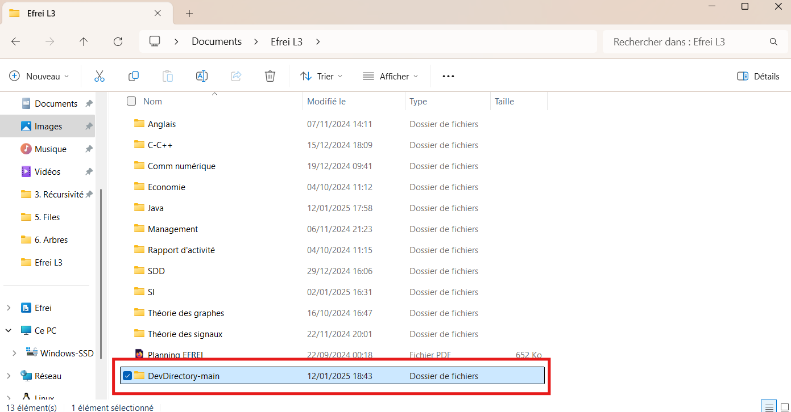
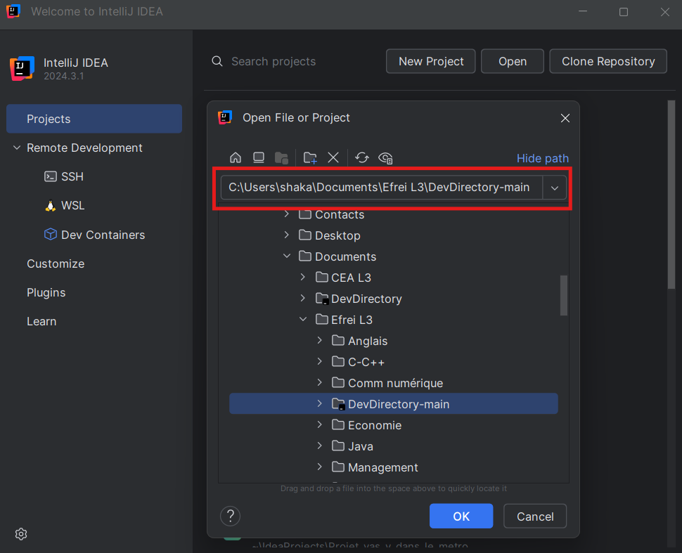
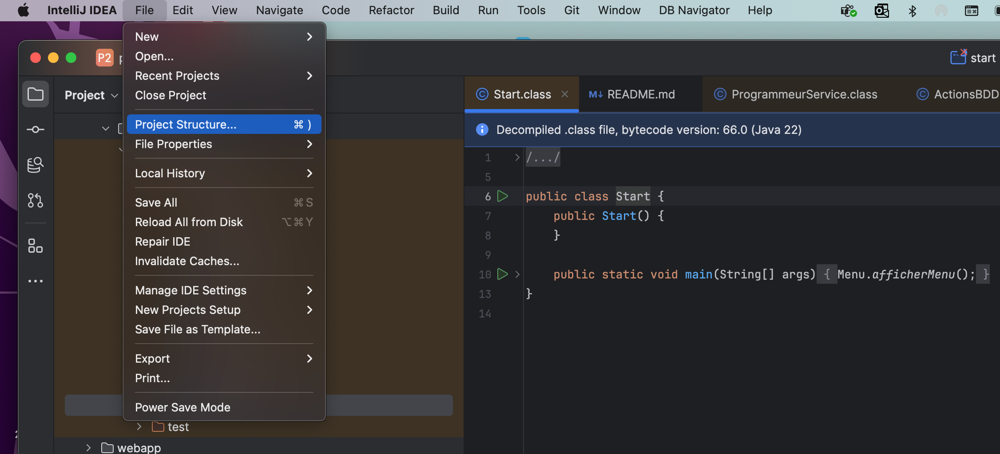
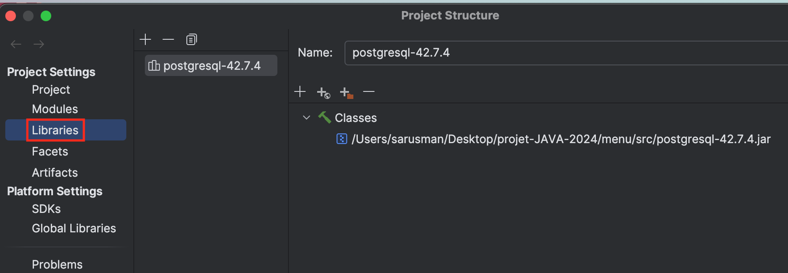
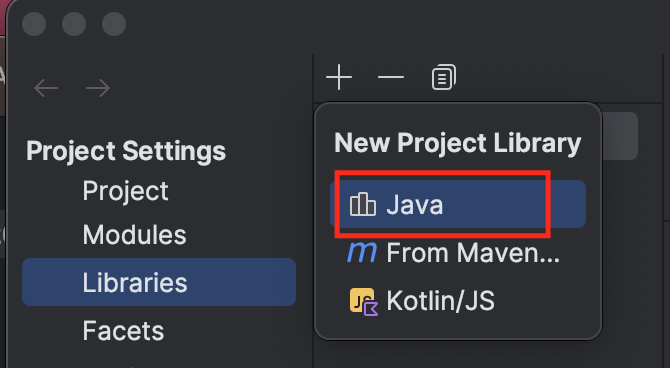
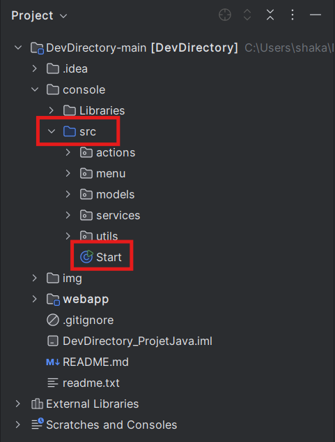
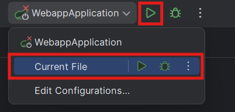
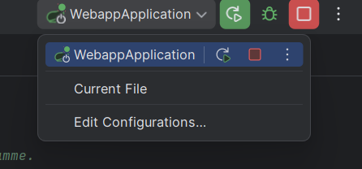
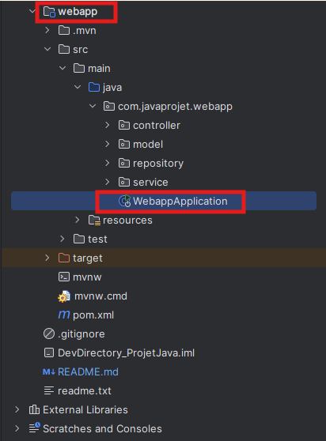
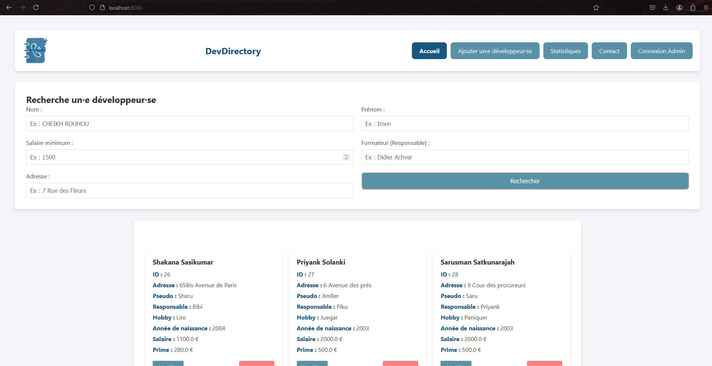

# DevDirectory - Projet Java 2024

## Description
DevDirectory est une application conçue pour la gestion de programmeurs avec une base de données. Elle est divisée en deux parties :
1. **Console** : Programme de base pour les opérations en ligne de commande.
2. **Webapp** : Bonus : Interface graphique avec de nouvelles fonctionnalités.

## Structure du projet
Le projet est organisé comme suit :
```
DevDirectory/
├── console/
│   ├── src/
│   │   ├── actions/
│   │   │   ├── ActionsBDD.java
│   │   │   └── ActionsBDDImpl.java
│   │   ├── menu/
│   │   │   └── Menu.java
│   │   ├── models/
│   │   │   ├── Programmeur.java
│   │   │   └── Responsable.java
│   │   ├── services/
│   │   │   └── ProgrammeurService.java
│   │   └── utils/
│   │       └── InputValidator.java
│   └── Librairies/
│       └── postgresql-42.7.4.jar
├── webapp/
│   ├── src/
│   │   ├── actions/
│   │   ├── menu/
│   │   ├── models/
│   │   ├── services/
│   │   └── utils/
├── readme.txt
└── README.md
```

---

## Prérequis
- **IDE recommandé** : IntelliJ IDEA Community Edition (CE)
- **Java JDK** : Version 11 ou supérieure

---

## Comment lancer le projet

### Étape 1 : Ouvrir le projet
1. Décompressez le dossier `DevDirectory.zip` à l'emplacement de votre choix.



2. Lancez IntelliJ IDEA CE.


3. Ouvrez le dossier `DevDirectory` en cliquant sur open.



---

### Étape 2 : Ajouter la bibliothèque PostgreSQL JDBC
Si vous rencontrez une erreur liée à JDBC :
1. Rendez-vous dans **File** → **Project Structure**.



2. Cliquez sur **Libraries**.



3. Cliquez sur le bouton **+** puis sélectionnez **Java**.



4. Ajoutez le fichier `.jar` situé dans :
   ```
   DevDirectory/console/Librairies/postgresql-42.7.4.jar
   ```
5. Validez et appliquez les modifications.

---

### Étape 3 : Configurer le répertoire source
Si le fichier `Start.java` (situé dans `console/src/`) ou les fichiers du dossier `webapp` ne sont pas exécutables :
1. Faites un clic droit sur les répertoires `console/src` et `webapp/src/java`.
2. Cliquez sur **Mark Directory as** → **Sources Root**.

---

### Étape 4 : Exécuter le projet
- Pour la **console** :
  Exécutez le fichier `Start.java` qui se trouve dans `console/src/`.


  
- Changez la configuration pour choisir l'option Current File si ce n'est pas déjà fait. Lancer le programme en cliquant sur le bouton Run.
  


- Le programme se lancera !
  


- Pour la **webapp** :
  Lancer la configuration fait automatiquement par IntelliJ 'WebappApplication'.
  


- Sinon naviguer vers le fichier WebappApplication.java situé dans le dossier /webapp/src/main/java/.
  


- Le site web sera disponible à l'adresse suivante : http://localhost:8080/ 
- Bonne navigation sur notre site !
 

--- 

## Choix de SGBD
Nous avons choisi PostgreSQL pour gérer nos données, car c’est une base de données gratuite et bien documentée.

Nous voulions stocker nos données en ligne pour y avoir accès de partout. Nous avons donc utilisé Supabase, qui est une plateforme basée sur PostgreSQL. Supabase est pratique pour les développeurs, car il offre des outils prêts à l’emploi, comme une interface facile pour gérer les données, un système d’authentification pour les utilisateurs, et même une API automatique pour accéder à la base de données. Cela nous a permis de gagner du temps et de nous concentrer sur le reste du projet.

PostgreSQL et Supabase nous donnent une solution simple, fiable et efficace pour gérer nos données et les rendre accessibles en ligne. C’est une bonne option pour notre petit projet avec une petite base de données.

---

## Fonctionnalités supplémentaires
- **Console** :
Nous avons ajouté des fonctionnalités pour rendre l’utilisation plus sûre et efficace. 
Lorsqu’un utilisateur ajoute ou modifie un programmeur, nous vérifions que les données saisies sont correctes (comme le format des numéros de téléphone).
Nous avons aussi mis en place un système pour éviter les doublons. Cela permet de s’assurer qu’un nom, un numéro de téléphone ou un responsable ne soit pas enregistré plusieurs fois par erreur.

- **Webapp** :
Nous avons créé une interface graphique qui reprend toutes les fonctionnalités disponibles dans la console, mais de manière plus intuitive et accessible. En plus, nous avons ajouté des pages spécifiques :

  - Une page pour afficher des statistiques sur les programmeurs.
  - Une fonctionnalité de recherche filtrée pour trouver des informations rapidement sur les programmeurs.
  - Une page de connexion pour les administrateurs afin de sécuriser l’accès.
  - Une page de contact pour permettre aux utilisateurs de poser des questions si besoin. 
  - Une option pour ajouter de nouveaux administrateurs directement depuis l’interface.
  - Ajout d'un easter egg sur la page d'accueil !

---

## Étudiants
- **SOLANKI Priyank**
- **SATKUNARAJAH Sarusman**
- **SASIKUMAR Sahkana**

---
